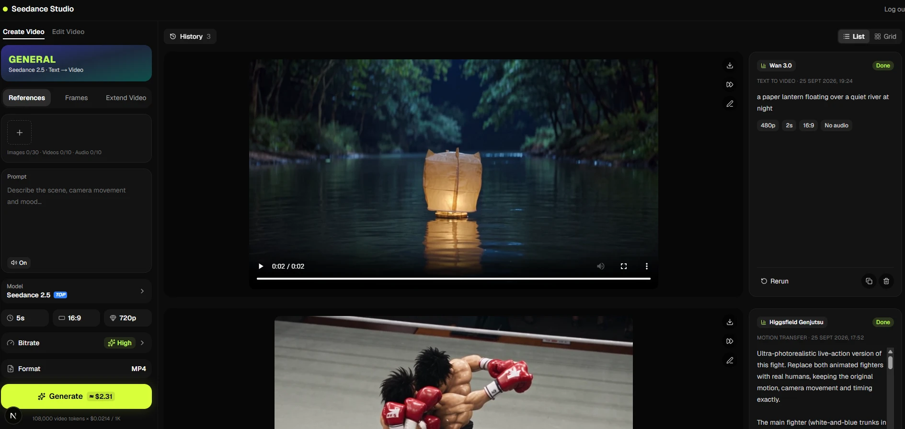

# Seedance Studio

📖 **Tutorial lengkap (Bahasa Indonesia): [docs/TUTORIAL.md](docs/TUTORIAL.md)**



Private web app for generating videos through the [Higgsfield API](https://docs.higgsfield.ai):

- **Seedance 2.5**: text, image (start/end frame), references with `@Image1`/`@Video1`/`@Audio1`
  prompt tags, video edit and video extend
- **Kling 3.0**: Standard, Pro and 4K tiers, text → video and image → video
- **MiniMax H3** (2K): text → video, image → video (first/last frame), and references (up to 9 images,
  3 videos and 3 audio, 12 total) with prompt tags
- **Higgsfield Genjutsu**: Motion Transfer (new character/style on an existing video's motion) and
  Object Swap (replace objects in a video), each with 1–8 reference images

- **Every other Higgsfield video model** (66 endpoints in total, e.g. Kling 2.5/2.6/O3/Omni and Motion
  Control, Seedance 2.0, Wan 2.6/2.7/3.0, Happy Horse, Cinema Studio, LTX-2.5, Hailuo 2.3, PixVerse V6,
  Grok Imagine). Pick one under **Model**, and the form is generated from its published JSON schema.

The model catalog lives in `lib/catalog.json`. Refresh it when Higgsfield adds models:

```bash
npm run sync-models
```

Video uploads open a trim dialog. The server cuts the chosen range with ffmpeg (`ffmpeg-static`) before
sending it to Higgsfield, which also lowers the cost of input-video-priced models. Click any reference
thumbnail to preview it full size.

## Setup

```bash
npm install
cp .env.example .env.local   # then fill in the values
npm run dev
```

Open http://localhost:3000 and sign in with `APP_PASSWORD`.

| Variable | Purpose |
|----------|---------|
| `HF_CREDENTIALS` | Higgsfield API key as `key-id:key-secret` ([console](https://console.higgsfield.ai)) |
| `APP_PASSWORD` | Shared password for the login page |
| `SESSION_SECRET` | ≥32 random characters used to sign the session cookie |
| `DB_PATH` | Optional, defaults to `data/app.db` |

Credentials stay on the server: the browser only talks to this app's `/api/*` routes.

## How it works

- `POST /api/jobs` validates the input per mode (`lib/schemas.ts`), submits it to
  Higgsfield and stores the `request_id` in SQLite. A `client_token` per submit
  makes double clicks and retries return the same job instead of paying twice.
- The gallery polls `GET /api/jobs/:id` (2 s → 10 s backoff with jitter). Each poll
  refreshes status from Higgsfield; jobs still running after 60 minutes are marked
  as timed out. Finished videos are downloaded to `storage/videos/`.
- Uploaded images, videos and audio go through `POST /api/uploads` to Higgsfield
  storage, and their public URLs are passed to the model.

## Costs

Every generation is billed by Higgsfield. The composer shows an estimate before you generate:

- Seedance 2.5: $0.0214 per 1,000 video tokens (input + output video). Roughly $0.82 for 4 s at 480p and
  $2.31 for 5 s at 720p (16:9)
- Kling 3.0: per output second. Standard $0.0462, Pro $0.0616, 4K $0.231. These are the console's
  promotional prices; list prices are $0.084 / $0.112 / $0.42
- MiniMax H3: $0.13 per generated second. The first 5 reference images are included; each extra image
  costs $0.08. These prices come from the reference-to-video docs and are applied to all H3 modes
- Genjutsu: per started second of input video. The promo price is $0.159 at 480p (720p assumed at the same
  50% off, $0.3405); list prices are $0.318 / $0.681

## Data

- Jobs: SQLite at `data/app.db`
- Finished videos: `storage/videos/`

Both folders are gitignored. Back them up if you want to keep the history.

## Scripts

- `npm test`: unit tests (Vitest)
- `npm run typecheck`
- `npm run example`: one-off SDK example (`index.ts`); makes a billable request
- `npm run build && npm start`: production
